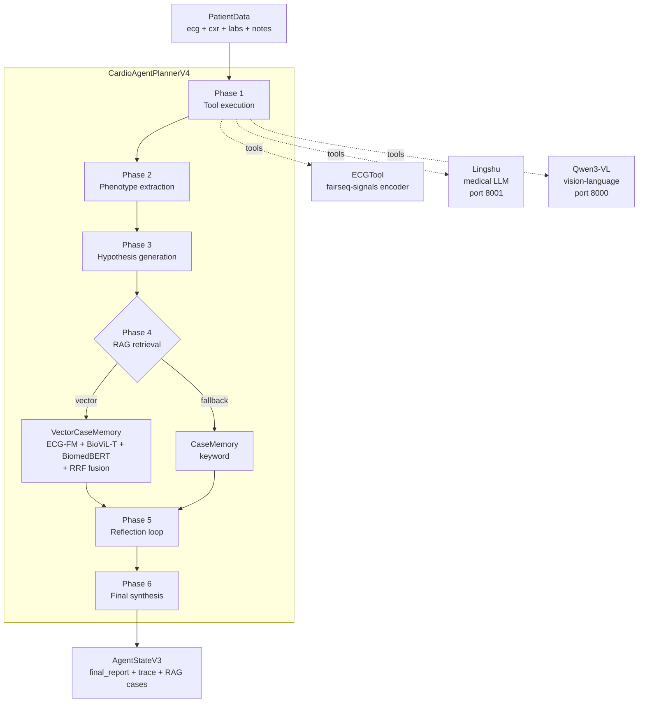

# Architecture

**CardioAgent** is a DeepRare-inspired multi-modal clinical decision-support
agent. Given a patient's ECG, chest X-ray (CXR), labs, and notes, it produces a
structured diagnosis with a reasoning trace, retrieved supporting cases, and
calibrated confidence per hypothesis.

The core idea: rather than asking a vision-language model to read a CXR and
guess (zero-shot), the system **plans** — it routes each modality to a
modality-specific tool, extracts clinical phenotypes from the tool outputs,
generates and ranks differential hypotheses, runs **dual-pathway retrieval**
over a multi-modal vector index, reflects on contradictions, and only then
synthesizes a final answer.

---

## High-level pipeline



Phase numbers correspond exactly to the `_run_*` calls in
[`src/agents/planner_v4.py`](../src/agents/planner_v4.py).

---

## Repository layout

```
src/
├── agents/         planner_v4.py, run.py
├── apps/           app.py, app_dis.py, lingshu_server.py
├── eval/           eval_v5.py
├── ablations/      ablation_modality.py, ablation_d.py, ablation_gpt5_4.py
├── memory/         vec_memory_new.py, symile_adapter.py
├── tools/          ecg_tool_v2.py, embedding_tool.py, lingshu_tool.py, reranker.py
├── preprocess/     mimic_ecg_preprocess.py
└── scripts/        ablation_*.sh, vec_memory.sh
```

---

## Components

### `src/agents/planner_v4.py` — `CardioAgentPlannerV4`

The orchestrator. Inherits from `CardioAgentPlannerV3` (DeepRare-style) and
**overrides Phase 4** to add the parallel vector-retrieval pathway. The six
phases:

| Phase | What happens                                                        | Output on `AgentStateV3`                                |
| ----: | ------------------------------------------------------------------- | ------------------------------------------------------- |
| **1** | Detect available modalities, run `_run_ecg`, `_run_image`, `_run_labs`, `_run_notes` | `tool_outputs`, `modalities_available`         |
| **2** | `PhenotypeExtractor.extract(state)` — surface clinical terms        | `phenotype_terms: List[{term, source, ...}]`            |
| **3** | `HypothesisGenerator.generate(...)` — ranked differential           | `hypothesis_ranking: List[Hypothesis]`                  |
| **4** | **Vector RAG → keyword fallback** (see below)                       | `rag_cases: List[dict]`                                 |
| **5** | `ReflectionEngine.run(...)` — re-score hypotheses against RAG cases | `cross_modal_consistency`, `reflection_rounds`          |
| **6** | `_run_synthesis(...)` — assemble the final structured report        | `final_report`                                          |

Notable design choices:

- Phases 1–3, 5–6 are **unchanged from v3**, so v4 is strictly additive.
- Phase 4 falls back from vector to keyword when the vector store returns
  zero results, so the planner degrades gracefully (e.g., before the index
  has been built).
- `enable_reflection` and `max_reflection_rounds=2` are exposed as
  constructor args for ablation flexibility.

### `src/memory/vec_memory_new.py` — `VectorCaseMemory`

Multi-modal dense retrieval backed by **ChromaDB** (one persistent client,
three collections):

| Collection         | Encoder        | Dim  | Source records                            |
| ------------------ | -------------- | ---: | ----------------------------------------- |
| `ecg_embeddings`   | ECG-FM         | 768  | MIMIC-IV-ECG signals (12-lead, 5000 samp) |
| `cxr_embeddings`   | BioViL-T       | 512  | MIMIC-CXR-JPG images (frontal preferred)  |
| `text_embeddings`  | BiomedBERT     | 768  | reports + lab text + notes                |

#### Online retrieval (`retrieve()`)

For each modality whose embedder + collection both exist:

1. Embed the query (signal / image / text).
2. Query the collection for `per_modality_k` (default **10**) candidates.
3. Convert ChromaDB L2 distance to similarity `1 / (1 + dist)`.

Then **fuse** across modalities with one of:

- **Reciprocal Rank Fusion (RRF)** — default. For each candidate `d`:
  $$\mathrm{RRF}(d) = \sum_m \frac{1}{k + \mathrm{rank}_m(d)},\quad k = 60$$
  Parameter-free, robust to heterogeneous score scales.
- **Weighted score** — default weights `ecg=0.4, cxr=0.4, text=0.2`, configurable.

Returns `top_k` (default **5**) `RetrievedCase` objects:

```python
@dataclass
class RetrievedCase:
    case_id: str
    source: str                        # "mimic_iv_ecg", "symile", ...
    diagnosis: str
    report: str
    score: float                       # fused score
    modality_scores: Dict[str, float]  # per-modality similarity
    modalities_matched: List[str]      # which collections hit
    metadata: dict
```

#### Optional cross-encoder reranking (D5)

When a `MedCPTReranker` is attached, the fusion layer retrieves `4 × top_k`
candidates, then the reranker scores `(query_text, candidate_report)` pairs
and trims to `rerank_top_n`. The query text is built from the planner's
phenotypes + top hypotheses, so the reranker sees the agent's evolving
intent — not just the raw inputs.

#### Offline index build (`build_index()` static method + CLI subcommands)

Three CLI subcommands in `vec_memory_new.py`:

| Subcommand     | Purpose                                                                |
| -------------- | ---------------------------------------------------------------------- |
| `build-train`  | Unified ECG + CXR + text from MIMIC-IV-ECG, joining CXR by `subject_id` |
| `build-cxr`    | CXR-only collection from MIMIC-CXR-JPG metadata + CheXpert labels       |
| `build-symile` | Add Symile-MIMIC train split as an additional source                    |

**ECG ↔ CXR temporal matching** in `build-train`: for each ECG, find the
patient's CXR studies and pick the one **closest in time**, preferring
frontal views (`PA > AP > LL`). If `mimic-cxr-2.0.0-metadata.csv.gz` is
absent, fall back to "first CXR per subject."

### `src/tools/` — modality-specific tools

| File                  | Class / role                                                           |
| --------------------- | ---------------------------------------------------------------------- |
| `ecg_tool_v2.py`      | `ECGTool` — runs the fairseq-signals ECG encoder + label classifier   |
| `embedding_tool.py`   | `ECGFMEmbedder`, `BioViLTEmbedder`, `BiomedBERTEmbedder` — vector encoders for the index |
| `lingshu_tool.py`     | OpenAI-style client to the Lingshu medical LLM server (port 8001)     |
| `reranker.py`         | `MedCPTReranker` cross-encoder for D5                                 |

The split between `ECGTool` (Phase 1 diagnostic tool) and `ECGFMEmbedder`
(Phase 4 retriever) is intentional: the diagnostic pathway and the retrieval
pathway run in parallel, on the same raw ECG, but produce different
artifacts (a symptom list vs. a 768-d embedding).

### `src/apps/`

| File                | Role                                                                 |
| ------------------- | -------------------------------------------------------------------- |
| `lingshu_server.py` | FastAPI / OpenAI-compatible server hosting the Lingshu medical LLM   |
| `app.py`            | Minimal Streamlit demo                                               |
| `app_dis.py`        | Full Streamlit demo with live workflow visualization (each phase streams), per-modality RAG score panel, and follow-up chat. See [`usage.md`](usage.md) §7. |

### `src/eval/eval_v5.py` and `src/ablations/ablation_modality.py`

`eval_v5.py` defines:

- **Data loaders:** `SymileTestData` (ECG + CXR + labs aligned, 6 CXR
  pathology labels), `MIMIC4ECGTestData` (ECG-only, 20 ECG diagnosis labels).
- **Ablation runners** (each implements `predict_symile` / `predict_mimic4`):
  - `AblationA` — Qwen3-VL zero-shot, no tools, no RAG.
  - `AblationB` — `CardioAgentPlannerV3` with `rag_index_paths=None`.
  - `AblationC` — `CardioAgentPlannerV3` with keyword RAG over `unified_index.jsonl ∪ mimic_iv_ecg_index.jsonl ∪ symile_index.jsonl`.
- **Prediction extraction** (`extract_predictions`) — multi-stage parsing:
  ```
  fenced JSON → POSITIVE/NEGATIVE pattern → keyword fallback
  ```
  Each call records which method succeeded so we can audit extraction-method
  drift across ablations.
- **Metrics** (`evaluate_predictions`) — `AUROC`, `AUPRC`, `F1`, `Precision`,
  `Recall`, `Specificity` per label; macro/micro AUROC + F1, exact match,
  Hamming loss overall. NaN ground-truth labels are excluded per-label
  rather than dropping whole samples.

`ablation_modality.py` defines `AblationD`, which uses `CardioAgentPlannerV4`
and toggles the three embedders / reranker according to a
`retrieval_mode` config:

```python
RETRIEVAL_MODES = {
    "D1":     {"ecg": True,  "cxr": False, "text": False, "rerank": False},
    "D2":     {"ecg": False, "cxr": True,  "text": False, "rerank": False},
    "D3":     {"ecg": False, "cxr": False, "text": True,  "rerank": False},
    "D4":     {"ecg": True,  "cxr": True,  "text": True,  "rerank": False},
    "D5":     {"ecg": True,  "cxr": True,  "text": True,  "rerank": True },
    "D-rand": {...,                                "counterfactual": "random"  },
    "D-shuf": {...,                                "counterfactual": "shuffle" },
}
```

D-rand swaps real retrieval for random cases drawn from the Chroma store
(matched in shape, not in semantics). D-shuf retrieves with shuffled
embeddings. Both serve as sanity checks: if the model performs the same with
random RAG, the retrieval pathway isn't doing real work.

---

## Data flow (concrete)

### 1. Inputs (`PatientData`)

```python
@dataclass
class PatientData:
    patient_id: str
    ecg_path: Optional[str]           # .npy or wfdb prefix
    image_path: Optional[str]
    image_type: Optional[str]         # "cxr" or "echo"
    lab_results: Optional[dict]       # itemid → {value, ref_range, ...}
    lab_text: Optional[str]
    clinical_notes: Optional[str]
```

### 2. Phase-by-phase artifacts

| Phase | Key artifact                                                                                                      |
| ----: | ----------------------------------------------------------------------------------------------------------------- |
| 1     | `tool_outputs["ecg"|"image"|"lab"|"notes"]` — structured tool returns                                            |
| 2     | `phenotype_terms = [{"term": "tachycardia", "source": "ecg", "evidence": "...", ...}, ...]`                       |
| 3     | `hypothesis_ranking = [Hypothesis(rank=1, diagnosis="Pulmonary edema", confidence=0.71, evidence_links=[...])]`   |
| 4     | `rag_cases = [{patient_id, diagnosis, report, score, modality_scores, modalities_matched}, ...]`                  |
| 5     | `cross_modal_consistency = {"n_agreements": 4, "n_contradictions": 1, ...}`; updated `hypothesis_ranking`         |
| 6     | `final_report` — markdown + a fenced JSON block matching the label schema                                          |

### 3. Output extraction

Inference produces free-text. `extract_predictions()` walks a fall-back
chain — JSON block → "Atelectasis: POSITIVE" pattern → keyword search in
`PATHOLOGY_KEYWORDS` — and records which method fired. We track this in
the metrics so we can detect when an ablation regresses to keyword-only
parsing.

### 4. Evaluation

```python
metrics = evaluate_predictions(ground_truth, predictions, label_set)
# metrics["per_label"][label] = {auroc, auprc, f1, precision, recall, specificity, ...}
# metrics["overall"]          = {macro_auroc, macro_auprc, macro_f1,
#                                micro_auroc, micro_f1, hamming_loss, exact_match}
# metrics["meta"]             = {ablation, n_total, n_succeeded, n_failed,
#                                avg_phenotypes, avg_hypotheses, avg_rag_cases,
#                                avg_reflection_rounds, extraction_methods, ...}
```

The `meta` block is the primary qualitative-debugging surface — it tells you
not just *how well* an ablation did, but *what shape* the runs took (how many
phenotypes per case, how often reflection was triggered, which extraction
path succeeded).

---

## Design decisions

### Why a planner instead of a fixed pipeline?

The DeepRare ablation in [`results.md`](results.md) shows the planner alone
(setting B) lifts Macro F1 by +17 points over Qwen3-VL zero-shot. Forcing the
agent to extract phenotypes and reason over typed tool outputs — rather than
free-associating from raw images — produces both more accurate and more
reliably formatted predictions.

### Why per-modality embedders instead of one CLIP-style joint encoder?

Three reasons:
1. **No pretrained joint encoder covers ECG + CXR + clinical text.** Symile-style
   trimodal models exist (we tried one — see `symile_adapter.py`) but the
   public weights are limited. Using the strongest available
   single-modality encoder per modality dominates.
2. **Late fusion lets us ablate cleanly.** Each collection is independent, so
   D1–D4 are toggles, not retraining runs.
3. **Index growth is modality-local.** Adding CXR data doesn't require
   re-embedding ECG, and vice versa.

### Why RRF as the default fusion?

RRF is parameter-free, requires no calibration of cross-modal score scales,
and is the standard choice in IR literature when score distributions are
heterogeneous. Our results, however, suggest it's suboptimal here: the best
single modality (D1) outperforms RRF (D4), motivating the cross-encoder
reranker in D5.

### Why two LLM servers (Qwen3-VL + Lingshu)?

- **Qwen3-VL** is multimodal — it reads CXR images natively for the zero-shot
  baseline (A), and is used as the synthesis backbone in B/C/D.
- **Lingshu** is a medical-text LLM specifically tuned for clinical phenotype
  extraction and reasoning, used inside Phase 1 (notes / lab interpretation)
  and Phase 5 (reflection).

Splitting roles keeps each model in its strength zone and lets us swap either
backbone without changing the planner.

### Graceful degradation

The planner is built so each component can fail independently:

- Vector retrieval fails → fall back to keyword retrieval.
- A modality is missing from `PatientData` → that tool is skipped, not
  errored.
- Reflection is gated on `enable_reflection` AND on hypothesis count > 0.
- An embedder fails to initialise (e.g. CUDA OOM) → that modality is
  silently dropped from the active retrievers and the others continue.

This makes the same code run identically across the seven ablation settings
(A, B, C, D1–D5) without conditional branches at the call sites.

---

## Extension points

| To add…                       | Edit…                                                            |
| ----------------------------- | ---------------------------------------------------------------- |
| A new modality (e.g. echo)    | new `XXXEmbedder` in `tools/embedding_tool.py`; new collection in `vec_memory_new.py`; new `_run_xxx` in `planner_v4.py` |
| A new fusion strategy         | `_fuse_*` method on `VectorCaseMemory` + add to `fusion_strategy` switch |
| A new ablation setting        | new entry in `RETRIEVAL_MODES` dict in `ablation_modality.py`    |
| A new evaluation dataset      | new `XxxTestData` loader in `eval_v5.py` mirroring `SymileTestData` |
| A new label space             | edit `PATHOLOGIES` / `ECG_DIAGNOSES` constants and the JSON output instruction in `eval_v5.py` |

---

## Glossary

- **DeepRare** — a published agentic medical-reasoning framework; our pipeline
  is structured similarly (tools → phenotypes → hypotheses → RAG → reflection
  → synthesis).
- **RRF (Reciprocal Rank Fusion)** — rank-based late-fusion algorithm with
  scoring `1/(k + rank)`, summed across rankers.
- **Symile** — a trimodal contrastive-learning paper / dataset that provides
  paired ECG + CXR + lab records on MIMIC-IV.
- **CheXpert labels** — 14 binary CXR pathology labels derived from radiology
  reports; we use 6 of them (`PATHOLOGIES`).
- **Hypothesis** — a candidate diagnosis with rank, confidence, and a list
  of `EvidenceLink`s pointing back to phenotype terms.
