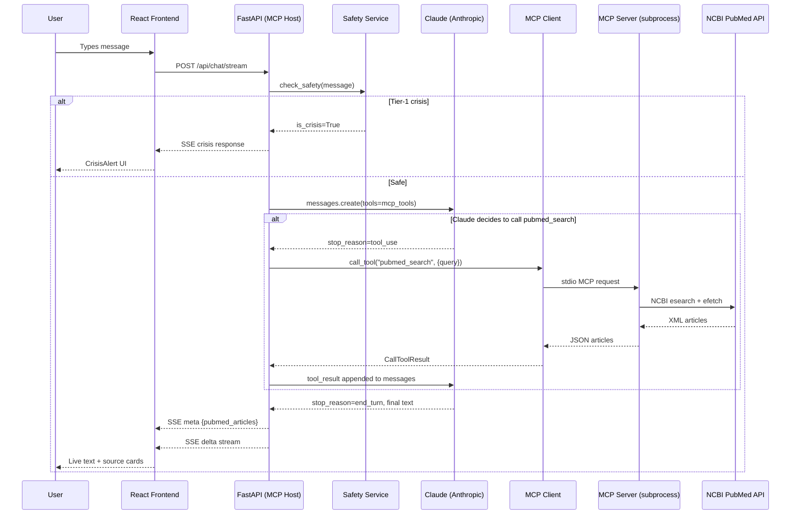

# Mental_Health_Bot — Architecture (v2: Real MCP)

## What Makes This Real MCP

| Aspect | Fake MCP (v1) | Real MCP (v2) |
|--------|---------------|---------------|
| Tool process | Same process as backend | **Separate subprocess** |
| Transport | Direct function call | **stdio (MCP wire protocol)** |
| Tool selection | Backend keyword heuristic | **Claude decides autonomously** |
| Tool schemas | Manually duplicated | **Fetched live from MCP server** |
| Adding tools | Edit backend code | **Add to MCP server only** |
| Protocol | None | **Full Model Context Protocol** |

---

## High-Level Architecture

```
Browser (React)
     │ HTTP / SSE
     ▼
FastAPI Backend  ─── MCP Host
     │
     ├─ Safety Service (regex, pre-LLM, <1ms)
     │
     ├─ Anthropic Service
     │    └─ Claude tool-use loop
     │         │
     │         ├─ MCP Client (stdio transport)
     │         │       │
     │         │       ▼
     │         │  MCP Server subprocess
     │         │    pubmed_search ──► NCBI PubMed API
     │         │    crisis_resources
     │         │
     │         └─ Final text response (streamed)
     │
     └─ SSE stream → Frontend
```

---

## Request Lifecycle



---

## MCP Tools

### `pubmed_search`
Claude calls this when the user asks about therapies, treatments, or research evidence.
Returns a JSON array of PubMed articles.

### `crisis_resources`
Claude calls this when the user seems distressed or asks for helplines.
Returns localised crisis hotlines by country code.

---

## Adding a New Tool

1. Open `mcp_server/server.py`
2. Add a `@mcp.tool()` decorated async function
3. Restart the backend
4. Claude discovers and uses it automatically — zero backend changes needed
